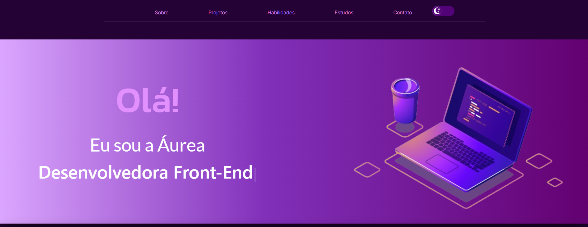

# portfolio-aurearibeiro

<h2 align="center">
 🎨 Portfólio - Áurea Ribeiro 
</h2>



<h4 align="center"><a href="https://portfolio-six-omega-18.vercel.app/">Clique para visitar o projeto</a></h4>

## 🎯 Tecnologias utilizadas

- React.js
- JavaScript
- Bootstrap
- HTML5
- CSS3

## 🕹️ Funcionalidades

- 🎨 Estilizado com React-Bootstrap e CSS <br>
- 📱 Totalmente responsivo <br>
- 🚀 Tema claro e escuro <br>
- 💻 Componentes Reutilizáveis e Dinâmicos <br>

## ⚙️ Como executar

- Clone o projeto em sua máquina:

```bash
  git@github.com:aureasiqueira1/portfolio-aurearibeiro.git
```

- Abra o projeto:

```bash
  cd portfolio-aurearibeiro
```

- Instale as dependencias (com yarn ou npm):

```bash
  yarn install
```

- Inicie o projeto (com yarn ou npm):

```bash
  yarn start
```
